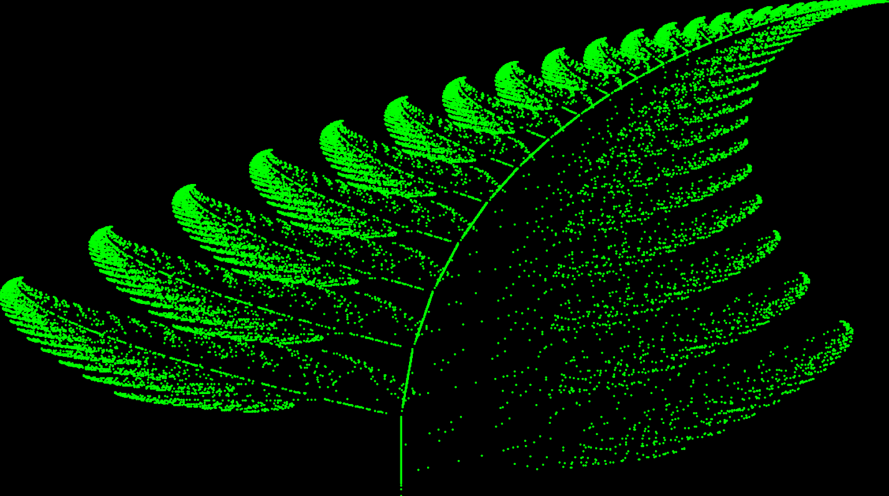
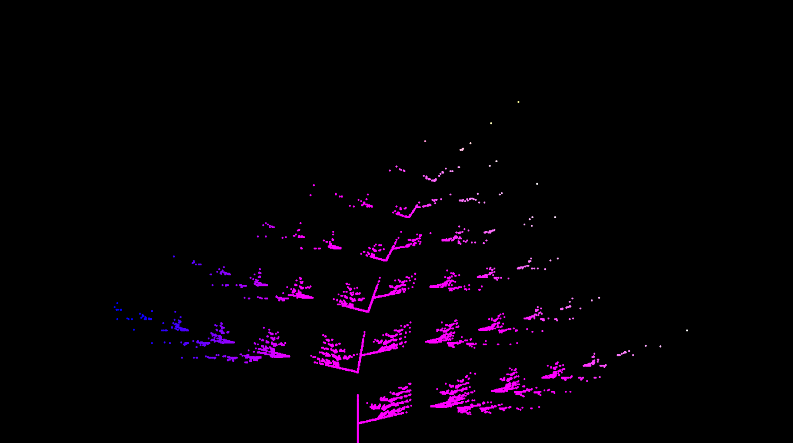
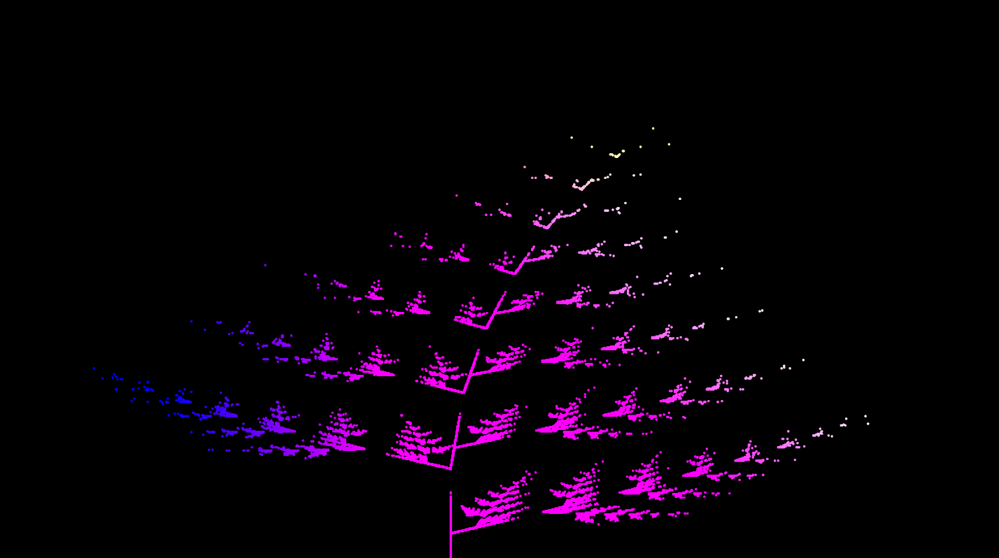

# Barnsely Fern 

Visualization of the famous [Barnsely Fern](https://en.wikipedia.org/wiki/Barnsley_fern) using Java Script and P5 library.

- Using The Original Formula 

  -  

    

    

- Green
  - 

- Random Probability

  -  

    

    
